# Azure Log Monitor Dashboard Screenshots

### App Delays

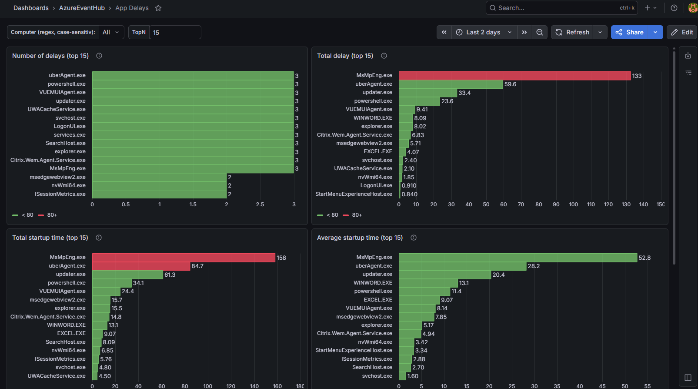

### Application Details

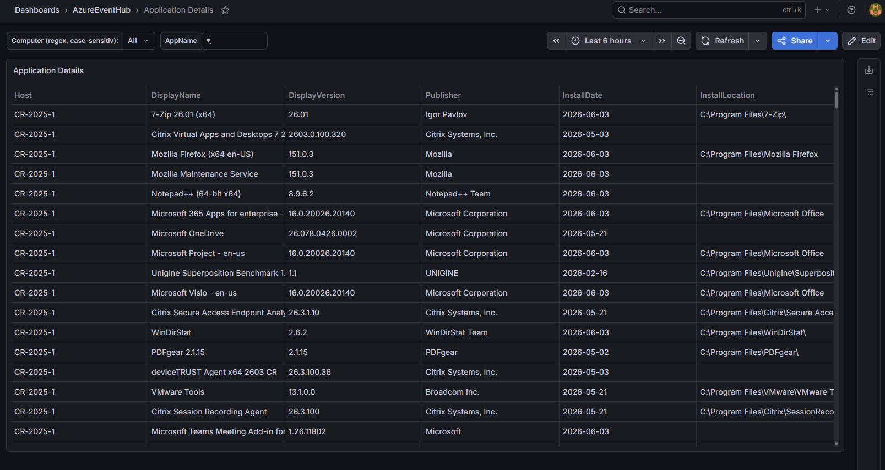

### Application Inventory

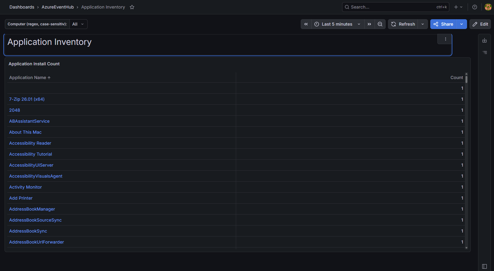

### Application Performance

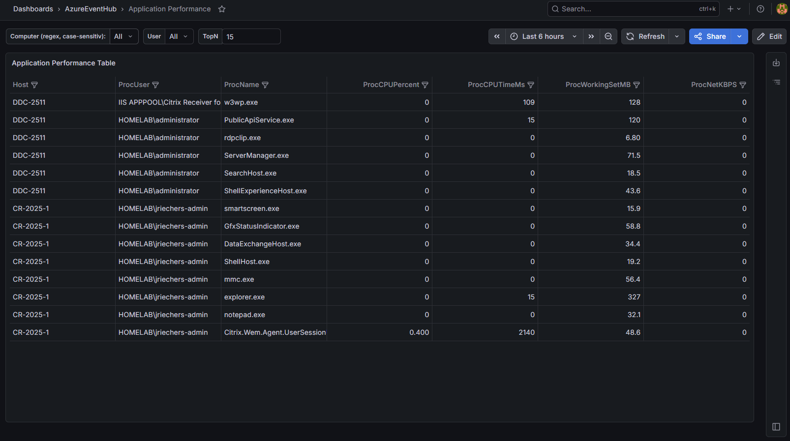

### Browser Usage

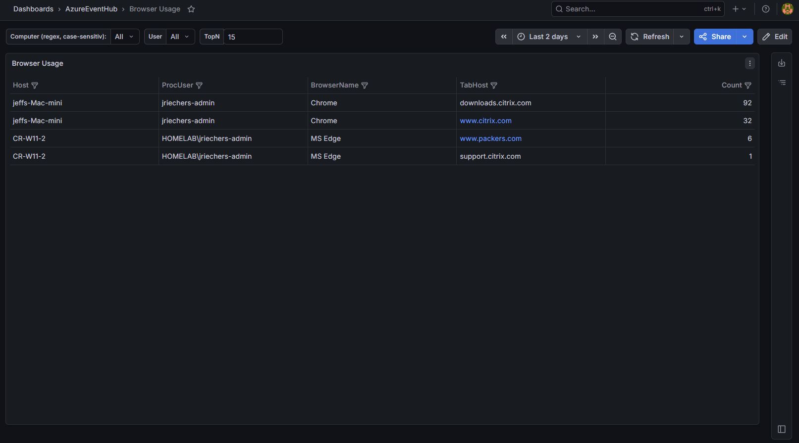

### Captured Event Logs

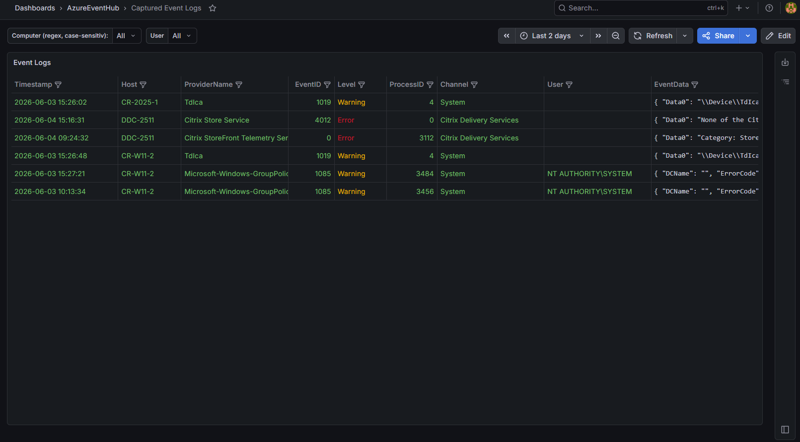

### Citrix Machine Registration and Sessions Detail

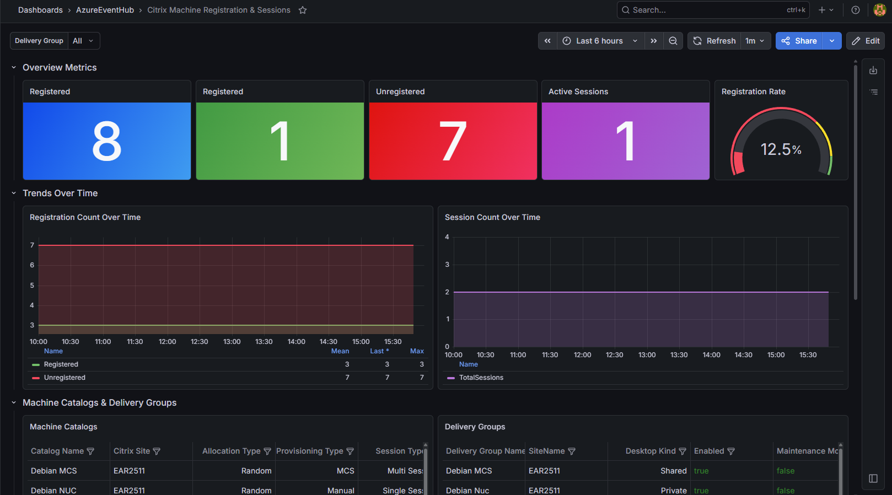

### Login Issues

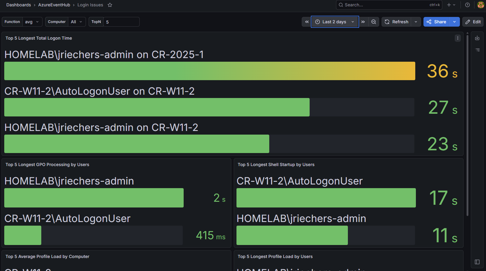

### Machine Hardware Details

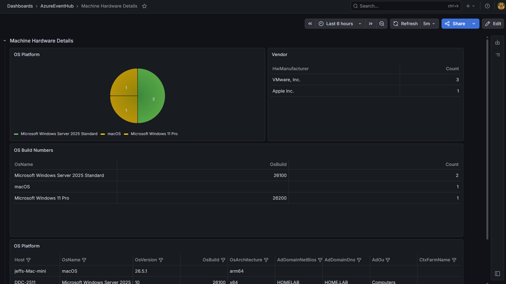

### Machine Performance VDI View

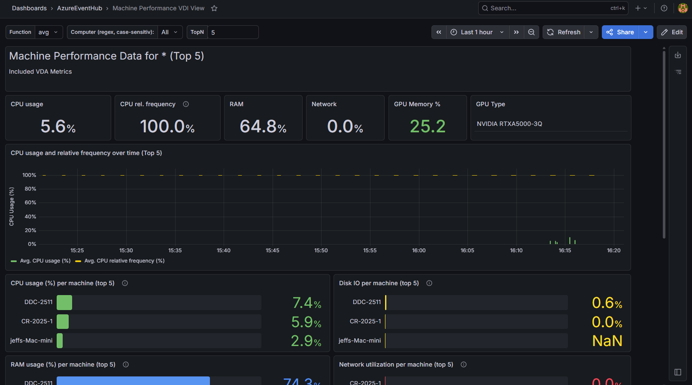

### Machine Performance VM View

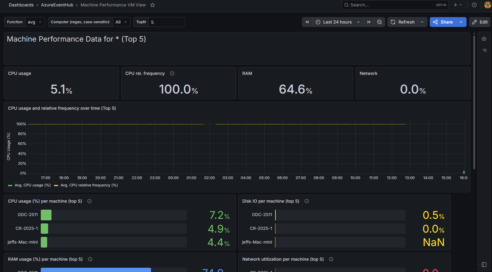

### SMB Client Performance

### Mitre ATT@CK Lookup

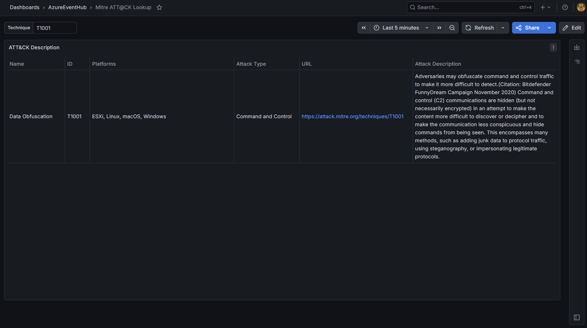

### Process Tree

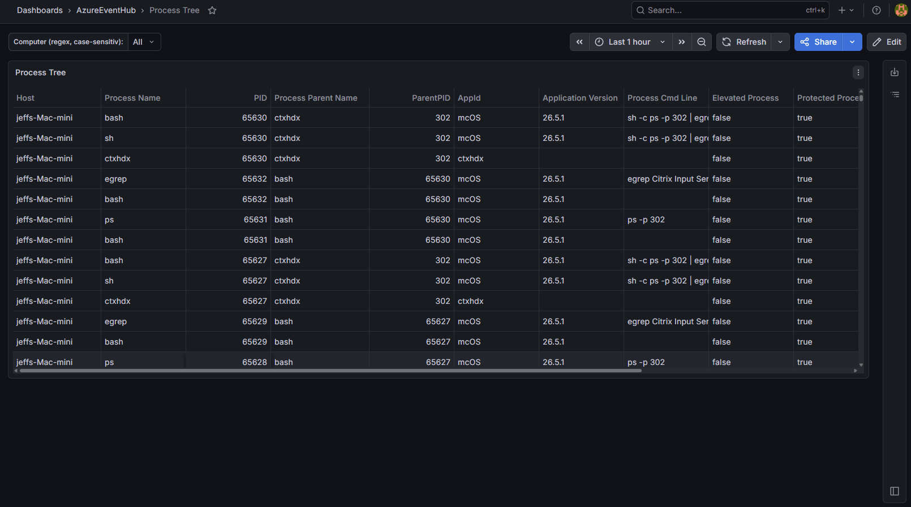

### Scheduled Tasks

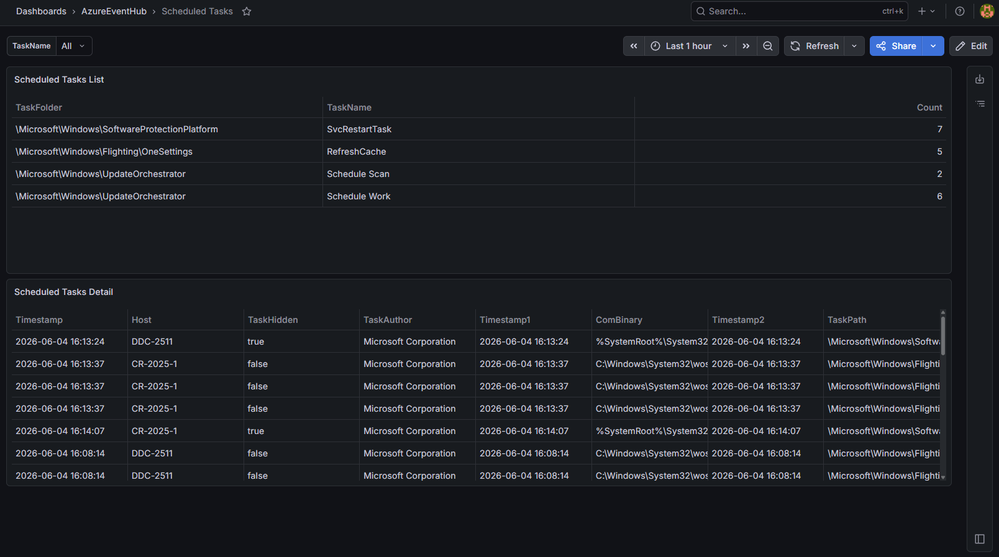

### SMB Client Performance

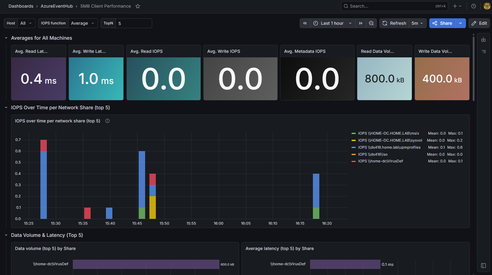

### User Session Overview

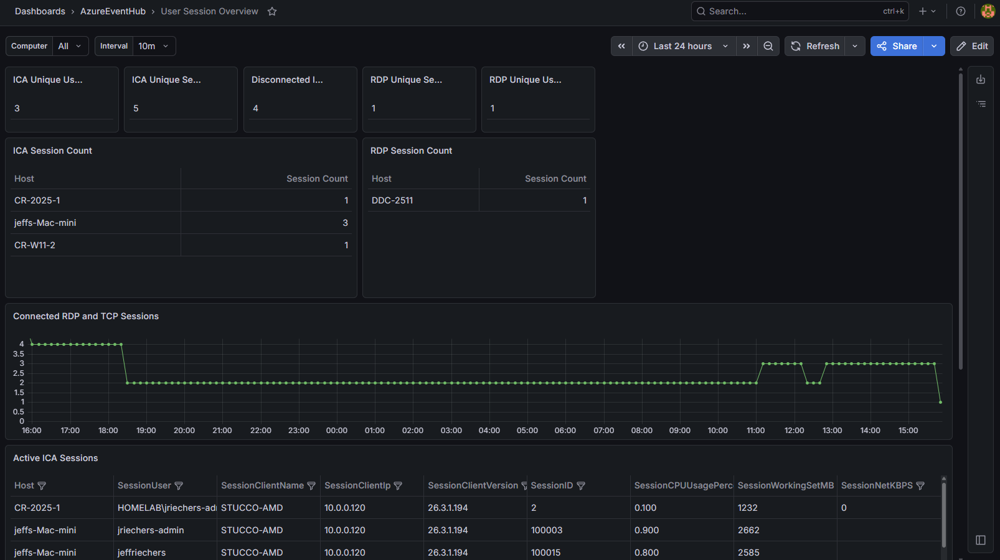
