# Grafana Console for UberAgent data in Elasticsearch database

This github is a repository for Grafana consoles to gather Citrix data from MSSQL DB queries, and from Elasticsearch with an UberAgent index.  Check the [Windows_install](./Windows_Install.md) for information on how to get started with Elasticsearch and Grafana setup in Windows.

Import the Grafana Dashboards under MSSQL and Elasticsearch and point them to Datasources defined in your environment.  Then setup UberAgent to send data to your Elasticsearch instance and begin viewing data.

I will contine to add Dashboards to this console, and will add Azure Data locations in the future as well.

### UPDATES

11-16-2025
More Consoles have been built dealing with Errors, Networking, and Processes.  Building consoles similar to the Splunk Consoles that don't have corresponding data available in Director.

11-11-2025
I have built a Windows Event Log Dashboard around the winlogbeat agent for Elasticsearch to consolidate all your event logs into an easily sortable, searchable table. [Read More Here](./WinLogBeat_Install.md)

11-10-2025
I added a Browser Usage and Browser Performance Dashboard to the Elasticsearch section.  These require the UberAgent browser plug-in to be deployed to the VDA.  Right now they detect Windows machines, but will be adding MACOS detection as well soon.

## Elasticsearch Dashboard Screenshots

### Application Details

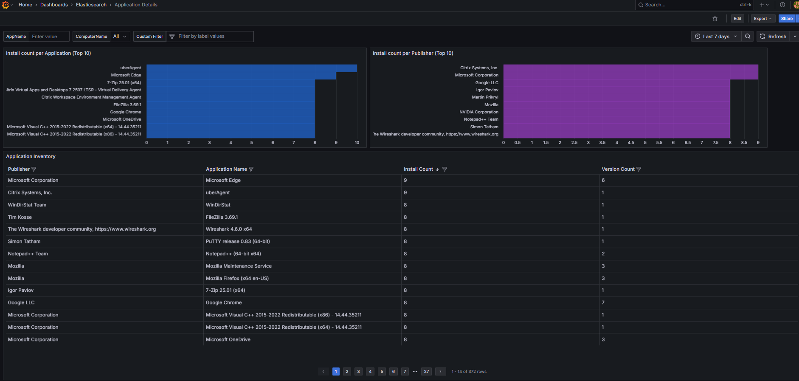

### Application Errors

### Browser Performance Metrics - Per User or VDA

### Browser Usage - Per User or VDA

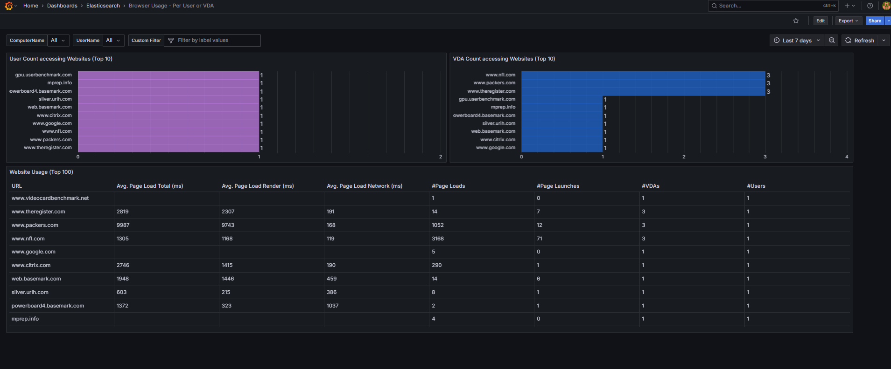

### Machine Network Issues

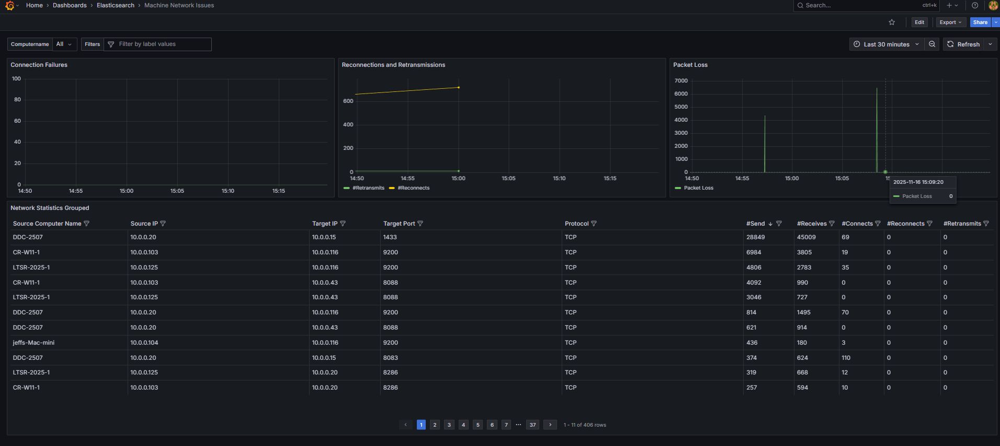

### Machine Performance

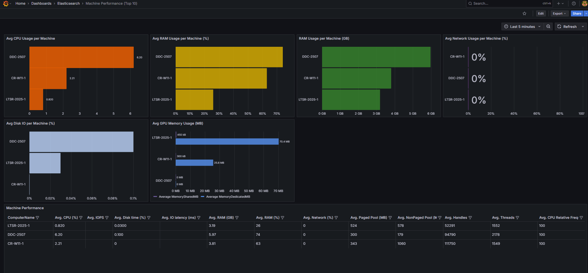

### Process Application Performance

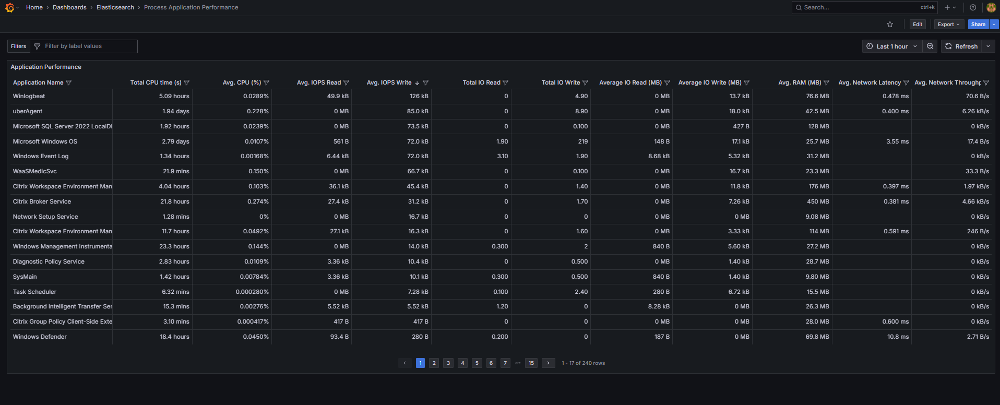

### Process Network Communication

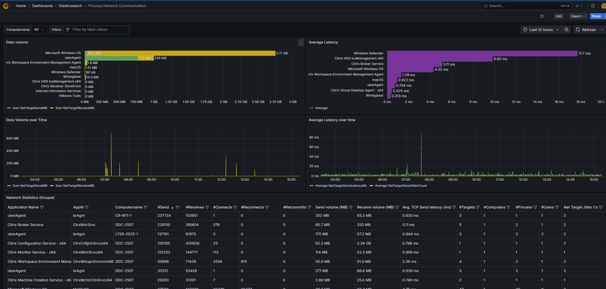

### Process Performance

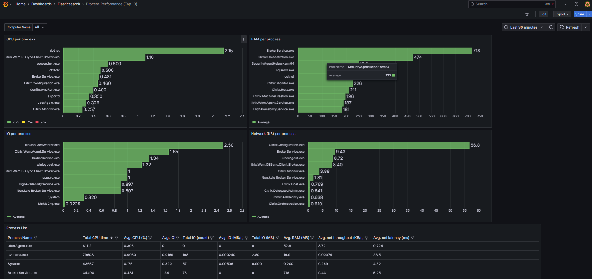

### Process UI Unresponsiveness

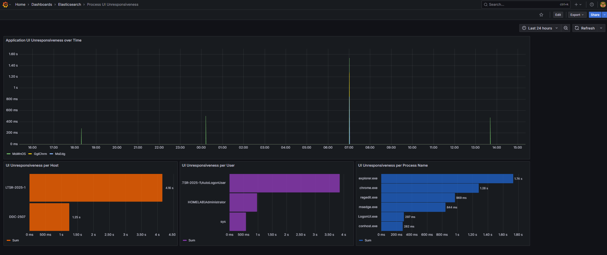

### Published Resources and CVAD Databases

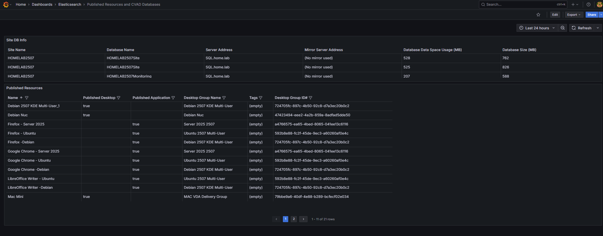

### User Session Overview

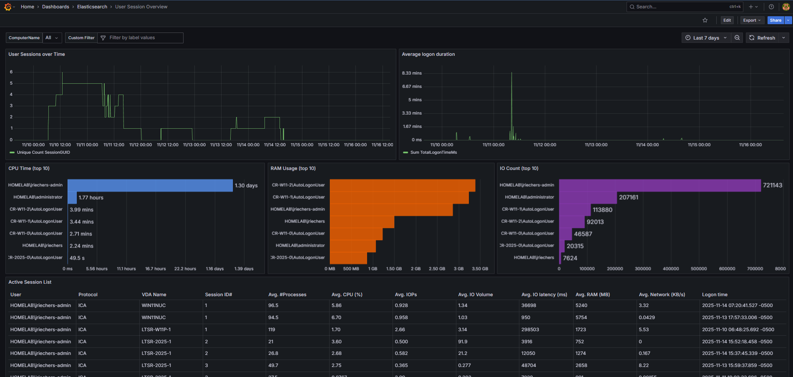

### Windows Event Logs

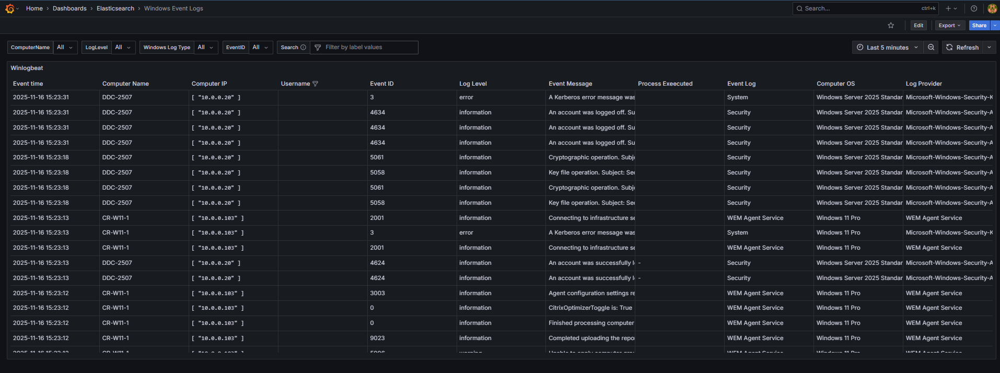

## MSSQL Dashboards

### Connected Session Detail

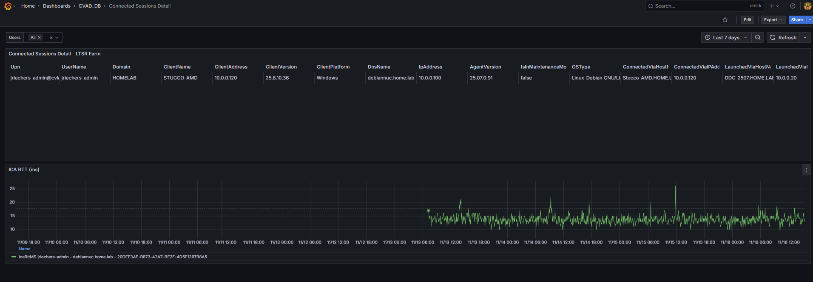
